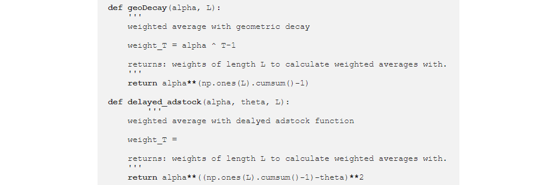

![Entry level: beginner][badge-beginner]
[](https://www.python.org/)
[](https://https://jira.com/)
[](https://https://docker.com/)
[](https://GitHub.com/Naereen/ama)


# Marketing Mix Modelling (MMM)

## How can this Model be useful for you?

### Behold, the power of MMM:

MMM allows you to **track your investment efficiency and optimize your budget**.There's no need to manually analyse the impressions and clicks through your channel and try to uderstand if that makes sense. Result are up-to-date with Sell-out results at GSeb. Look through the results via Web-Service, API or MS SQL Database. 

## Beloved Features

MMM is ready for today's budget optimization.

1. Automatic collection of investment.
2. Automatic update of Sell-out.
3. Keep-Alive old versions of investment efficiency to be able to compare.
4. Budget optimization from target or budget.
5. Filters on TOP innovation products.
6. Digital interface.

MMM is supported by Qlik Sense Dashboard, and runs greatly on Web Local Host.

<!-- START doctoc generated TOC please keep comment here to allow auto update -->
<!-- DON'T EDIT THIS SECTION, INSTEAD RE-RUN doctoc TO UPDATE -->
## Table of Contents

- [The User Guide](#the-user-guide)
- [The API Guide](#the-api-guide)
- [The Contributor Guide](#the-contributor-guide)
- [What's next?](#whats-next)

<!-- END doctoc generated TOC please keep comment here to allow auto update -->
<!-- generated with [DocToc](https://github.com/thlorenz/doctoc) -->

## The User Guide

This part of the documentation, which is mostly prose, begins with some background information about MMM, then focuses on step-by-step instructions for getting the most out of MMM.

### Quickstart
#### What is MMM?

Market Mix Modeling (MMM) is a technique which helps in quantifying the impact of several marketing inputs on sales or Market Share. The purpose of using MMM is to understand how much each marketing input contributes to sales, and how much to spend on each marketing input.

MMM helps in the ascertaining the effectiveness of each marketing input in terms of Return on Investment. In other words, a marketing input with higher return on Investment (ROI) is more effective as a medium than a marketing input with a lower ROI.

***Here are the steps we follow during modelling:***


MMM uses the Regression technique and the analysis performed through Regression is further used for extracting key information/insights.

<details><summary>Issues with English? Click to unfold</summary>
<p>

You may resort to subtitles/closed captions and
to auto-translated subtitles in particular if you feel
it would help you to master the video course better.


Employ Google Translate for textual materials.

</p>
</details>

The video below offers an intro to the Marketing Mix concept (RUS).

[](https://www.youtube.com/watch?v=KayneNonWX8)

#### Terminology in use
**Multi-Linear Regression** 
As mentioned earlier, Market Mix Modeling uses the principle of Multi-Linear Regression. The dependent variable could be Sales or Market Share. The independent variables usually used are Distribution, price, TV spends, outdoor campaigns spends, newspaper and magazine spends, below the line promotional spends, and Consumer promotions information etc. Nowadays, Digital medium is highly used by some marketers to increase brand awareness. So, inputs like Digital spends, website visitors etc. can also be used as inputs for MMM.

**Factors in Model**
Within the collection stage of marketing mix modelling, econometric techniques are used to estimate product demand produced by marketing tactics by separating product sales into *2 types of sales drivers*:
- ***Incremental*** drivers
    - *Above the line* media activity (TV, print ads, digital ads, promotions, and discounts, etc.)
    - *Below-the-line* factors (temporary selling prices, sales promotions, discounts, social media, direct mail marketing campaigns, in-store marketing, events, and conferences.)


- ***Base*** drivers
The base outcome for a business is the sales that are achieved in the absence of any incremental marketing activity. Base outcomes are often the result of brand equity and reputation that has been built up over several years, for example, [customer loyalty](https://blog.hurree.co/blog/customer-retention-strategy).

**The following elements are base drivers:**
- *Price:* The price of a product is a significant base driver of a marketing mix as price determines both the consumer segment that a product is targeted toward and the promotions which are implemented to market the product to the chosen audience.
- *Distribution:* The number of store locations, the stock within those locations, and the shelf life of that stock are all considered as base drivers of the marketing mix. Store locations and the inventory within them are static and can be discovered by customers without any marketing intervention.
    
    
    
- *Seasonality:* Certain variations happen periodically within a business year and can thus be relied upon to drive sales with a level of predictability. Seasonal sales, such as the winter holiday period, are huge drivers for the business. In 2018, for example, the eCommerce industry grew 16.7%, reaching up to $123.90 billion because of the holiday spending spree.


#### Interpretation of results

In the analysis stage, the outputs of your chosen model will be examined; these outputs will come in the form of decomposition of sales, which breaks the data down into volume for each modelled tactic.

**There are 3 significant metrics when it comes to analysing the decomposition of sales:**

- Effectiveness
- Efficiency
- Return on Investment (ROI)

The rentability concept becomes more clear in the picture below:

 

Return on investment (ROI) is a performance measure used to evaluate the efficiency or profitability of an investment or compare the efficiency of a number of different investments. ROI tries to directly measure the amount of return on a particular investment, relative to the investment's cost.
You will be able to gain information on these metrics for your marketing efforts as a whole, and for each tactic individually.

 

This final stage of MMM essentially sees you turn your outputs into inputs - full circle style; meaning, you use the results of your analysis to optimise your marketing mix for future campaigns.

Part of the optimisation will include a “what if” simulation. The outputs of your marketing model are equations that demonstrate the relationship between marketing activities and sales results. With these equations, you can predict what will happen if changes are made to the marketing mix.

 

For example, “what if” I decrease the price of Coca Cola cans by 5%. This question considers how changes to incremental factors such as promotional discounts will impact sales, and your model output will return an accurate answer, which you can use to inform your promotions strategy.

#### Diminishing Returns

The underlying principle for TV advertisement is that the exposure to TV ads create awareness to a certain extent in the customers’ minds. Beyond that, the impact of exposure to ads starts diminishing over time. Each incremental amount of GRP would have a lower effect on Sales or awareness. 

So, the sales generated from incremental GRP start to diminish and become constant. This effect can be seen in the above graph, where the relationship between TV GRP and sales in non-linear. This type of relationship is captured by taking exponential or log of GRP.

#### Carry over effect or Decay Effect

The impact of past advertisement on present sales is known as Carry over effect. A small component termed as lambda is multiplied with the past month GRP value. This component is also known as Decay effect as the impact of previous months’ advertisement decays over time.

### Advanced Usage

If you are looking for information on uploading raw data or use Web-Service, this part of the documentation is for you.

#### Get results via Qlik Sense Dashboard

You can use this [link](https://mydataviz.seb.com/sense/app/d0f1975d-b13e-432d-98e4-82e271c6674f/sheet/32c57b0b-1f12-4731-bd7b-d2a4a1263da7/state/analysis) to access Dashboard:

 

#### Get results with Web-Service

You can use this [link](https://www.google.com/) to access Service.

#### Get results with MS SQL

You can use the `[BI Test].[ecom].[MarketingMixCosts]` to access raw data in Database.
```sql
SELECT [Year]
      ,[Week]
      ,[TV_prime_prod]
      ,[TV_nonprime_prod]
      ,[TV_prime_dealer]
      ,[TV_nonprime_dealer]
      ,[OLV]
      ,[Social]
      ,[Dzen]
      ,[twogis]
      ,[Paid_Bloggers]
      ,[Programmatic]
      ,[SEM_google]
      ,[SEM_Yandex]
      ,[Prod_type]
  FROM [BI Test].[ecom].[MarketingMixCosts]
```


## The API Guide

If you are looking for information on a specific function, class, or method, this part of the documentation is for you.

### Developer Interface

Carryover effects, often called lagged effects, occur when media spend effects sales across a number of days. The module ***geoDecay*** represents weighted average with geometric decay:

 

For example, if we spend $100 on display advertising today, we may not see the effects of this spend for several days. The adstock function attempts to parameterize this phenomenon and the paper takes two approaches to adstock modeling:

You can connect to the interface through API.
An application programming interface (API) is a connection between computers or between computer programs. It is a type of software interface, offering a service to other pieces of software.[1] A document or standard that describes how to build such a connection or interface is called an API specification. A computer system that meets this standard is said to implement or expose an API. The term API may refer either to the specification or to the implementation.

```html
<!DOCTYPE html>
<head>
<script src="https://code.jquery.com/jquery-2.1.1.min.js"></script>
<script>
// limit the result through days parameter to keep the returned data set light
var settings = {
  "async": true,
  "crossDomain": true,
  "url": "https://api.openweathermap.org/surfreport/25&days=1",
  "method": "GET"
}

// use ajax method to allow for asynchronous calls that won't block page loading
$.ajax(settings).done(function (response) {
  console.log(response);
  $("#surfheight").append(response.surfreport.conditions);
});
</script>
</head>
<body>
<h2>Surf Height</h2>
<div id="surfheight"></div>
</body>
</html>
```

## The Contributor Guide

If you want to contribute to the project, this part of the documentation is for you.


## What's next?

There are no more guides. You are now guideless. Good luck.

---

[badge-beginner]: https://img.shields.io/badge/Entry%20level-advanced-red.svg
